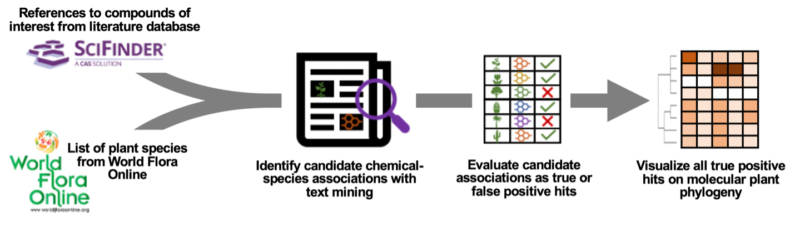

# Phylochemical Mapping

## Overview
The Phylochemical Mapping project aims to elucidate the phylogenetic distribution  of plant natural products. By leveraging recent advances in natural language processing, we've created a workflow to map natural products onto the plant tree of life, revealing lineage-specific compound distributions and providing insights into plant chemical diversity. This repository hosts the raw data and R code necessary to reproduce our findings, which pertain to tyrosine-derived compounds.

## Data
Contained within this repository is the complete set of raw data used in our analyses. The data are structured to facilitate easy replication of our results and further exploration of phylochemical distributions across different plant lineages.

## R Code
The R scripts provided enable the recreation of our results from the ground-up. They are extensively commented to aid in understanding and can be adapted for extended analyses or related projects.

## Results
By mining and manually curating over 3,500 compound-species associations from peer-reviewed scientific literature, we have created a phylochemical map that highlights various lineage-specific compounds and provides a system-level view of tyrosine compounds in plants. This is proof-of-concept and can be extended to other classes of natural products in the future. We have applied large language models to our manually curated data, demonstrating that post-mining processing can be efficiently automated while maintaining a low false positive rate.

## Contribution to the Scientific Community
The expansion of our phylochemical database stands to offer a novel community resource, revealing key evolutionary events and enabling a comprehensive view of the chemical experimentation nature has undergone over millions of years.

## License
This project is licensed under the MIT License - see the `LICENSE.md` file for details.

## Citation
If you use the data or code from this project in your research, please cite it as follows:
> Busta, L., Hall, D., Johnson, B., Schaut, M., Hanson, C.M., Gupta, A., Gundrum, M., Wang, Y. and A. Maeda, H., 2024. Mapping of specialized metabolite terms onto a plant phylogeny using text mining and large language models. The Plant Journal.

For any further inquiries, please open an issue or contact the repository maintainers directly.

